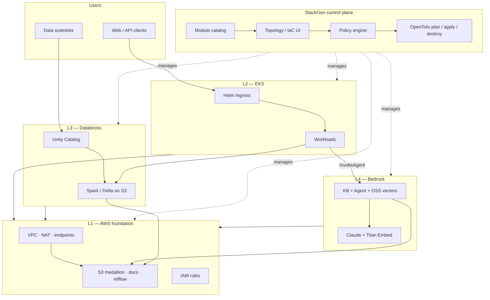
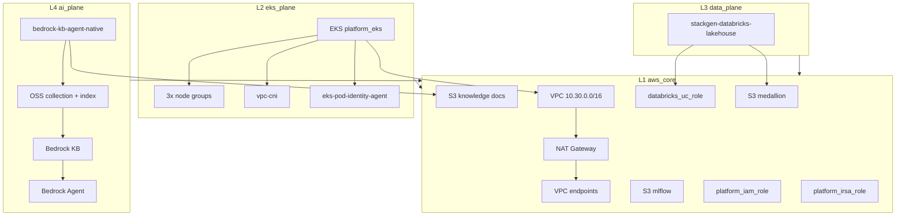
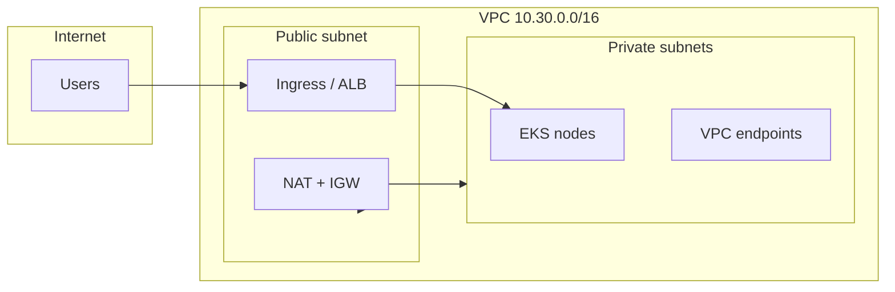

# stackgen-eks-databricks-bedrock-platform

Deploy a complete AWS platform for **Kubernetes apps**, **Databricks analytics**, and **Bedrock AI (RAG)** — from one [StackGen](https://stackgen.com) topology, with Terraform modules and step-by-step runbooks.

---

## Overview

This repository helps you stand up a reference stack on AWS without wiring EKS, Databricks, and Bedrock in three separate projects.

You get a private EKS cluster for applications, a Databricks lakehouse on S3, and a Bedrock Knowledge Base + Agent that answers questions from your documents. Everything shares the same VPC, IAM model, and storage — so an app on EKS can call the agent while analysts query the same data in Databricks.

The stack is managed with **StackGen** (visual topology + OpenTofu apply) and maintained as **Terraform modules** you can reuse in your own projects. It includes create/destroy guides and a checklist built from real deployment failures — so the second run goes smoother than the first.

**Reference appstack:** `eks-databricks-bedrock-layer-validation`

---

## What you can build

- **Ask questions of your docs (RAG)** — Bedrock Agent retrieves from S3 via OpenSearch Serverless vectors  
- **Run analytics on the same data** — Databricks Unity Catalog points at a shared medallion bucket  
- **Host the app on Kubernetes** — Private EKS cluster with optional Helm workloads  
- **Repeat deploys safely** — Snapshots, policy checks, and documented gotchas for workshops or CI  

---

## What's in this repo

| Path | Description |
|------|-------------|
| [`bedrock-kb-agent-native/`](bedrock-kb-agent-native/) | Bedrock KB, Agent, OpenSearch Serverless, IAM |
| [`stackgen-databricks-lakehouse/`](stackgen-databricks-lakehouse/) | Databricks external location + storage credential |
| [`examples/eks-databricks-bedrock-layer-validation/`](examples/eks-databricks-bedrock-layer-validation/) | Full docs, diagrams, config templates |

**Docs you'll use most:**

| | |
|---|---|
| [Configure credentials & env vars](examples/eks-databricks-bedrock-layer-validation/docs/CONFIGURATION.md) | Databricks PAT, AWS runner, StackGen profile |
| [Create the stack](examples/eks-databricks-bedrock-layer-validation/docs/CREATE.md) | First-time deploy |
| [Destroy the stack](examples/eks-databricks-bedrock-layer-validation/docs/DESTROY.md) | Clean teardown |
| [Pre-flight checklist](examples/eks-databricks-bedrock-layer-validation/docs/CHECKLIST.md) | Before every plan/apply |
| [Known gotchas](examples/eks-databricks-bedrock-layer-validation/docs/GOTCHAS.md) | Fixes for common apply failures |

---

## Getting started

1. **Fork or clone** this repo and upload the custom modules to your StackGen project ([instructions in CREATE.md](examples/eks-databricks-bedrock-layer-validation/docs/CREATE.md)).
2. **Set secrets** on your StackGen environment profile — at minimum `databricks_host`, `databricks_token`, and `region` ([CONFIGURATION.md](examples/eks-databricks-bedrock-layer-validation/docs/CONFIGURATION.md)).
3. **Run the gate sequence** — snapshot → violations = 0 → plan → apply → verify ([CHECKLIST.md](examples/eks-databricks-bedrock-layer-validation/docs/CHECKLIST.md)).
4. **Tear down when done** — empty S3 buckets, destroy plan, destroy ([DESTROY.md](examples/eks-databricks-bedrock-layer-validation/docs/DESTROY.md)).

You need an AWS account with Bedrock model access, a Databricks workspace, and a StackGen project with remote state configured.

---

## Architecture

### Platform context (StackGen + four planes)



### Infrastructure topology (L1–L4, Terraform-managed)

Validated appstack: **`eks-databricks-bedrock-layer-validation`**. Bedrock uses **OpenSearch Serverless** (not a managed OpenSearch domain).



### Network layout (private EKS)



Source files (editable): [`examples/eks-databricks-bedrock-layer-validation/diagrams/`](examples/eks-databricks-bedrock-layer-validation/diagrams/)  
Deep dive: [`docs/ARCHITECTURE.md`](examples/eks-databricks-bedrock-layer-validation/docs/ARCHITECTURE.md)

The stack is built in four layers: shared AWS networking and storage (L1), EKS (L2), Databricks (L3), and Bedrock (L4). See the example README for a resource-level breakdown.

---

## Custom modules

| Module | Version | Purpose |
|--------|---------|---------|
| [`bedrock-kb-agent-native`](bedrock-kb-agent-native/) | **1.0.14+** | Bedrock KB, Agent, OSS collection + vector index, IAM |
| [`stackgen-databricks-lakehouse`](stackgen-databricks-lakehouse/) | **1.0.5+** | UC storage credential, external location, SQL endpoint |

Upload to StackGen (project scope):

```bash
stackgen upload custom-modules \
  --scope project \
  --name bedrock-kb-agent-native \
  --repo-url https://github.com/swami086/stackgen-eks-databricks-bedrock-platform \
  --subdir bedrock-kb-agent-native \
  --version 1.0.14
```

Repeat for `stackgen-databricks-lakehouse` at version `1.0.5`.

## Repository layout

```
stackgen-eks-databricks-bedrock-platform/
├── bedrock-kb-agent-native/          # L4 — Bedrock KB + Agent + OSS
├── stackgen-databricks-lakehouse/    # L3 — Databricks UC wiring
├── examples/
│   └── eks-databricks-bedrock-layer-validation/
│       ├── README.md                 # Project overview + diagrams
│       ├── docs/                     # Create, destroy, checklist, config, gotchas
│       ├── config/                   # env.example.tfvars (no secrets committed)
│       └── diagrams/                 # Mermaid source (.mmd)
└── README.md                         # This file
```

## Requirements

- AWS account with Bedrock enabled (Claude + Titan Embed in your region)  
- StackGen project with OpenTofu runner and S3 remote state  
- Databricks workspace URL and personal access token  

See [CONFIGURATION.md](examples/eks-databricks-bedrock-layer-validation/docs/CONFIGURATION.md) for the full list of environment variables and credentials.

## License

Forked from [`dharanistack/terraform-aurora-patterns`](https://github.com/dharanistack/terraform-aurora-patterns). Formerly published as `swami086/terraform-aurora-patterns`.
