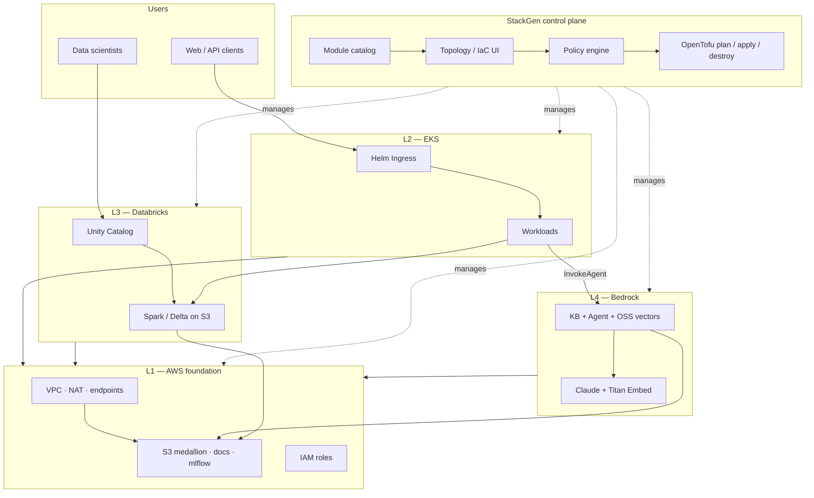
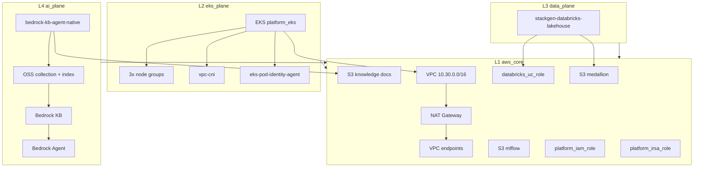
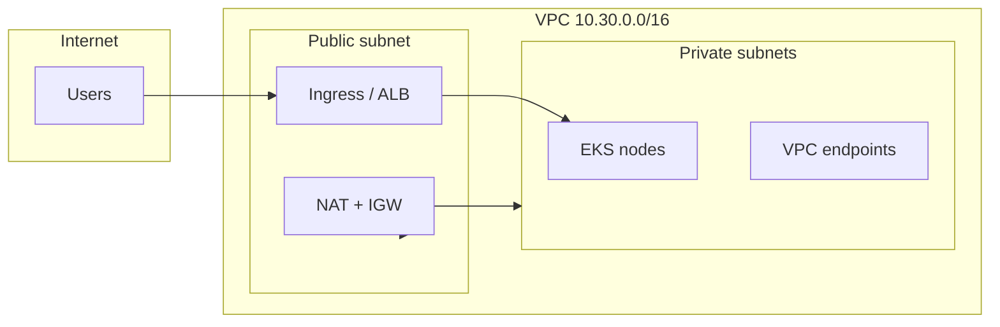

# stackgen-eks-databricks-bedrock-platform

Terraform modules and a **reference architecture** for running a four-plane AWS platform on [StackGen](https://stackgen.com):

- **EKS** — private application cluster with optional Helm workloads  
- **Databricks Unity Catalog** — medallion lakehouse on S3  
- **Amazon Bedrock** — Knowledge Base + Agent with OpenSearch Serverless vectors  

This repository is the **module source** (`bedrock-kb-agent-native`, `stackgen-databricks-lakehouse`) and the **operational documentation** for deploying and tearing down the stack safely.

---

## Architecture

### Platform context (StackGen + four planes)



### Infrastructure topology (L1–L4, Terraform-managed)

Validated appstack: **`eks-databricks-bedrock-layer-validation`**. Bedrock uses **OpenSearch Serverless** (not a managed OpenSearch domain).



### Network layout (private EKS)



Source files (editable): [`examples/eks-databricks-bedrock-layer-validation/diagrams/`](examples/eks-databricks-bedrock-layer-validation/diagrams/)  
Deep dive: [`docs/ARCHITECTURE.md`](examples/eks-databricks-bedrock-layer-validation/docs/ARCHITECTURE.md)

---

## Reference architecture docs

| Item | Location |
|------|----------|
| **Start here** | [`examples/eks-databricks-bedrock-layer-validation/README.md`](examples/eks-databricks-bedrock-layer-validation/README.md) |
| Create the stack | [`docs/CREATE.md`](examples/eks-databricks-bedrock-layer-validation/docs/CREATE.md) |
| Destroy the stack | [`docs/DESTROY.md`](examples/eks-databricks-bedrock-layer-validation/docs/DESTROY.md) |
| Pre-flight checklist | [`docs/CHECKLIST.md`](examples/eks-databricks-bedrock-layer-validation/docs/CHECKLIST.md) |
| Known gotchas | [`docs/GOTCHAS.md`](examples/eks-databricks-bedrock-layer-validation/docs/GOTCHAS.md) |

**Example StackGen project:** `workshop-dharani`

## Custom modules

| Module | Version | Purpose |
|--------|---------|---------|
| [`bedrock-kb-agent-native`](bedrock-kb-agent-native/) | **1.0.14+** | Bedrock KB, Agent, OSS collection + vector index, IAM |
| [`stackgen-databricks-lakehouse`](stackgen-databricks-lakehouse/) | **1.0.5+** | UC storage credential, external location, SQL endpoint |

Upload to StackGen (project scope):

```bash
stackgen upload custom-modules \
  --scope project \
  --name bedrock-kb-agent-native \
  --repo-url https://github.com/swami086/stackgen-eks-databricks-bedrock-platform \
  --subdir bedrock-kb-agent-native \
  --version 1.0.14
```

Repeat for `stackgen-databricks-lakehouse` at version `1.0.5`.

## Repository layout

```
stackgen-eks-databricks-bedrock-platform/
├── bedrock-kb-agent-native/          # L4 — Bedrock KB + Agent + OSS
├── stackgen-databricks-lakehouse/    # L3 — Databricks UC wiring
├── examples/
│   └── eks-databricks-bedrock-layer-validation/
│       ├── README.md                 # Project overview + diagrams
│       ├── docs/                     # Create, destroy, checklist, gotchas
│       └── diagrams/                 # Mermaid source (.mmd)
└── README.md                         # This file
```

## Requirements

- AWS account with Bedrock model access (Claude + Titan Embed) in your region  
- StackGen project with OpenTofu runner and S3 remote state  
- Databricks workspace + personal access token for Unity Catalog resources  
- IAM permissions for EKS, VPC, S3, OpenSearch Serverless, Bedrock, IAM  

## License

Forked from [`dharanistack/terraform-aurora-patterns`](https://github.com/dharanistack/terraform-aurora-patterns). Formerly published as `swami086/terraform-aurora-patterns`.
