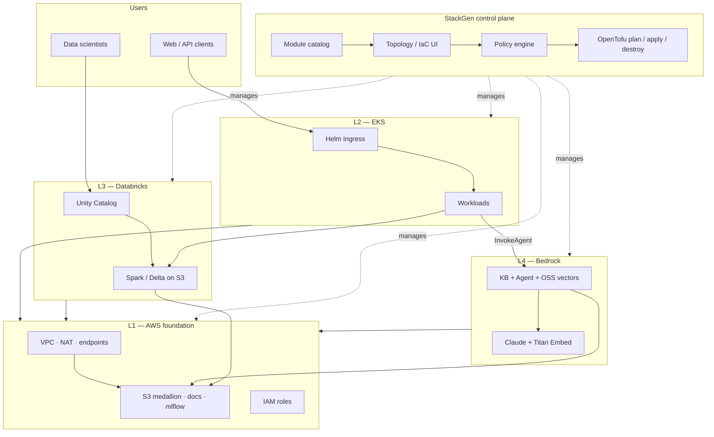
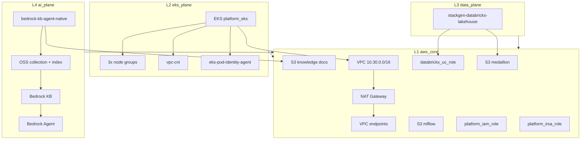
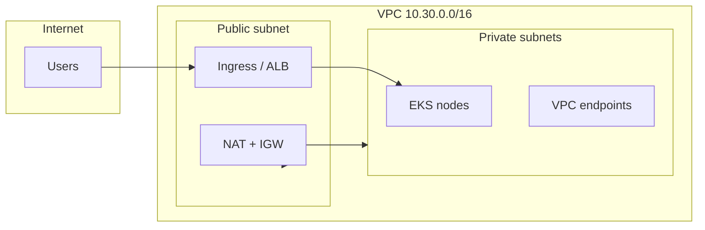

# stackgen-eks-databricks-bedrock-platform

**A production-style AWS reference platform** for running **Kubernetes applications**, a **Databricks lakehouse**, and **generative AI (RAG)** on a single, repeatable StackGen topology — with Terraform modules, runbooks, and workshop-hardened create/destroy guidance.

---

## About this project

Organizations often build **EKS**, **Databricks**, and **Bedrock** in separate silos: different teams, different IaC repos, and no shared networking or identity model. That makes it hard to answer practical questions like *“Can our app on EKS call a Bedrock Agent that retrieves from documents in S3 while analysts query the same data in Databricks?”*

This repository is the **answer and the blueprint** for that pattern. It packages everything needed to stand up — and safely tear down — a **four-layer AWS platform** managed through [StackGen](https://stackgen.com):

| Layer | Plane | Role |
|-------|-------|------|
| **L1** | `aws_core` | Shared foundation — VPC, NAT, private subnets, VPC endpoints, KMS-encrypted S3 buckets, IAM, DNS |
| **L2** | `eks_plane` | Private **Amazon EKS** cluster for application and agent workloads |
| **L3** | `data_plane` | **Databricks Unity Catalog** external location on a medallion S3 bucket |
| **L4** | `ai_plane` | **Amazon Bedrock** Knowledge Base + Agent with **OpenSearch Serverless** vectors |

The reference appstack is named **`eks-databricks-bedrock-layer-validation`**. It was built and tested layer-by-layer (L1 → L4) so each plane can be validated independently before the full stack is applied.

### What problem it solves

- **Unified data + AI path** — Knowledge documents live in S3; Bedrock indexes them into a vector store; Databricks reads the same medallion bucket for analytics; EKS hosts clients that invoke the agent.
- **Private-by-default AWS** — EKS API is private; nodes egress via NAT; AWS service calls use VPC endpoints (including Bedrock runtime APIs).
- **IaC you can operationalize** — Not just modules: documented **create**, **destroy**, **checklist**, **configuration**, and **gotchas** from real apply failures (Pod Identity, OSS index ordering, Databricks trust policies, etc.).
- **StackGen-native** — Custom modules register in the StackGen catalog; topology, policy gate, snapshots, and per-environment variables live in StackGen — not scattered shell scripts.

### Primary use cases

1. **Interactive RAG** — A service on EKS (or elsewhere) calls a Bedrock Agent; the agent retrieves context from a Knowledge Base backed by OpenSearch Serverless and documents in S3.
2. **Lakehouse analytics** — Data engineers use Databricks SQL/Spark against the same medallion bucket registered as a Unity Catalog external location.
3. **Platform workshops & CI** — Repeatable create → verify → destroy cycles with StackGen snapshots, violation checks, and pinned module versions.
4. **Module reuse** — Import `bedrock-kb-agent-native` or `stackgen-databricks-lakehouse` into your own StackGen project without copying the full topology.

### What this repository contains

| Contents | Description |
|----------|-------------|
| **`bedrock-kb-agent-native/`** | Terraform module — Bedrock KB, Agent, OSS collection + vector index, IAM (v1.0.14+) |
| **`stackgen-databricks-lakehouse/`** | Terraform module — UC storage credential, external location, SQL endpoint (v1.0.5+) |
| **`examples/eks-databricks-bedrock-layer-validation/`** | Full reference docs: create, destroy, checklist, configuration, architecture diagrams |
| **Runbooks & gotchas** | Workshop-validated steps so the *second* deploy does not repeat the *first* deploy’s failures |

This is **not** a managed SaaS product. It is an **open reference implementation**: you bring your AWS account, Databricks workspace, StackGen project, and credentials ([CONFIGURATION.md](examples/eks-databricks-bedrock-layer-validation/docs/CONFIGURATION.md)).

### How it works (high level)

1. **Design** the topology on the StackGen canvas (or clone the reference appstack).
2. **Upload** custom modules from this repo to your StackGen project catalog.
3. **Configure** environment profile variables (`databricks_host`, `databricks_token`, `region`, optional bucket names) and S3 remote state.
4. **Gate** each change: snapshot → violations = 0 → plan → apply → verify → plan again.
5. **Destroy** safely when done: empty S3 buckets (or `force_destroy` in dev), destroy plan, teardown.

Detailed steps: [CREATE.md](examples/eks-databricks-bedrock-layer-validation/docs/CREATE.md) · [DESTROY.md](examples/eks-databricks-bedrock-layer-validation/docs/DESTROY.md)

### Who this is for

- **Platform / DevOps engineers** wiring EKS + data + AI on AWS with StackGen  
- **Solutions architects** evaluating a Bedrock RAG + lakehouse pattern on private VPC  
- **Workshop facilitators** needing a reproducible stack with documented failure modes  
- **Module consumers** who only need Bedrock KB/Agent or Databricks UC wiring in isolation  

### Validated environment (example)

| Item | Example value |
|------|----------------|
| StackGen project | `workshop-dharani` |
| Environment profile | `swami_env` |
| AWS region | `us-east-1` |
| EKS cluster | `platform_eks` (private API) |
| Vector store | OpenSearch Serverless (not legacy managed OpenSearch) |

Your names and account IDs will differ; the docs use placeholders where needed.

---

## Architecture

### Platform context (StackGen + four planes)



### Infrastructure topology (L1–L4, Terraform-managed)

Validated appstack: **`eks-databricks-bedrock-layer-validation`**. Bedrock uses **OpenSearch Serverless** (not a managed OpenSearch domain).



### Network layout (private EKS)



Source files (editable): [`examples/eks-databricks-bedrock-layer-validation/diagrams/`](examples/eks-databricks-bedrock-layer-validation/diagrams/)  
Deep dive: [`docs/ARCHITECTURE.md`](examples/eks-databricks-bedrock-layer-validation/docs/ARCHITECTURE.md)

---

## Reference architecture docs

| Item | Location |
|------|----------|
| **Start here** | [`examples/eks-databricks-bedrock-layer-validation/README.md`](examples/eks-databricks-bedrock-layer-validation/README.md) |
| Create the stack | [`docs/CREATE.md`](examples/eks-databricks-bedrock-layer-validation/docs/CREATE.md) |
| Destroy the stack | [`docs/DESTROY.md`](examples/eks-databricks-bedrock-layer-validation/docs/DESTROY.md) |
| Pre-flight checklist | [`docs/CHECKLIST.md`](examples/eks-databricks-bedrock-layer-validation/docs/CHECKLIST.md) |
| **Credentials & env vars** | [`docs/CONFIGURATION.md`](examples/eks-databricks-bedrock-layer-validation/docs/CONFIGURATION.md) |
| Known gotchas | [`docs/GOTCHAS.md`](examples/eks-databricks-bedrock-layer-validation/docs/GOTCHAS.md) |

**Example StackGen project:** `workshop-dharani`

## Custom modules

| Module | Version | Purpose |
|--------|---------|---------|
| [`bedrock-kb-agent-native`](bedrock-kb-agent-native/) | **1.0.14+** | Bedrock KB, Agent, OSS collection + vector index, IAM |
| [`stackgen-databricks-lakehouse`](stackgen-databricks-lakehouse/) | **1.0.5+** | UC storage credential, external location, SQL endpoint |

Upload to StackGen (project scope):

```bash
stackgen upload custom-modules \
  --scope project \
  --name bedrock-kb-agent-native \
  --repo-url https://github.com/swami086/stackgen-eks-databricks-bedrock-platform \
  --subdir bedrock-kb-agent-native \
  --version 1.0.14
```

Repeat for `stackgen-databricks-lakehouse` at version `1.0.5`.

## Repository layout

```
stackgen-eks-databricks-bedrock-platform/
├── bedrock-kb-agent-native/          # L4 — Bedrock KB + Agent + OSS
├── stackgen-databricks-lakehouse/    # L3 — Databricks UC wiring
├── examples/
│   └── eks-databricks-bedrock-layer-validation/
│       ├── README.md                 # Project overview + diagrams
│       ├── docs/                     # Create, destroy, checklist, config, gotchas
│       ├── config/                   # env.example.tfvars (no secrets committed)
│       └── diagrams/                 # Mermaid source (.mmd)
└── README.md                         # This file
```

## Requirements

- AWS account with Bedrock model access (Claude + Titan Embed) in your region  
- StackGen project with OpenTofu runner and S3 remote state  
- Databricks workspace + personal access token for Unity Catalog resources  
- IAM permissions for EKS, VPC, S3, OpenSearch Serverless, Bedrock, IAM  

**Configure all secrets and variables before first apply:** [CONFIGURATION.md](examples/eks-databricks-bedrock-layer-validation/docs/CONFIGURATION.md)

## License

Forked from [`dharanistack/terraform-aurora-patterns`](https://github.com/dharanistack/terraform-aurora-patterns). Formerly published as `swami086/terraform-aurora-patterns`.
