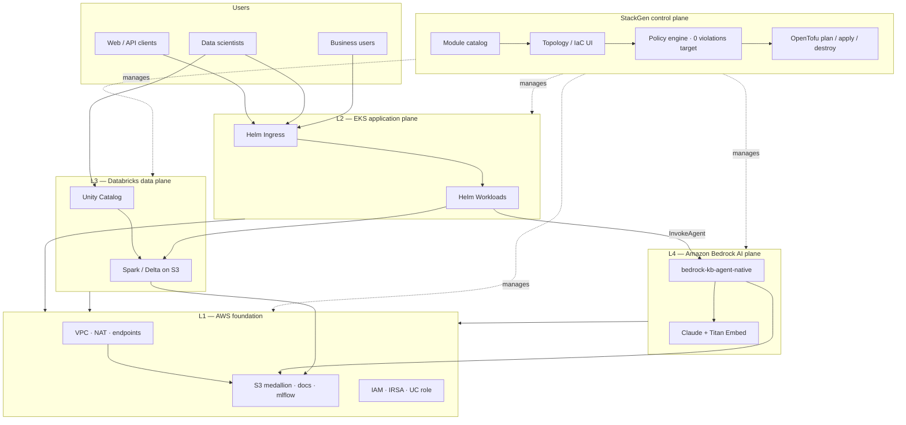
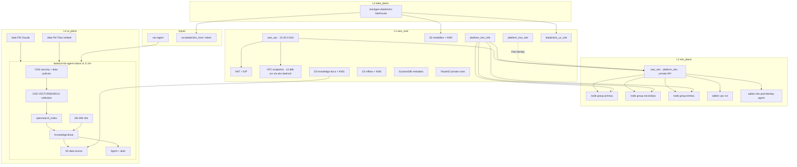
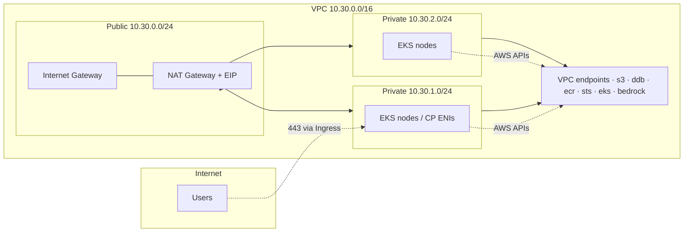
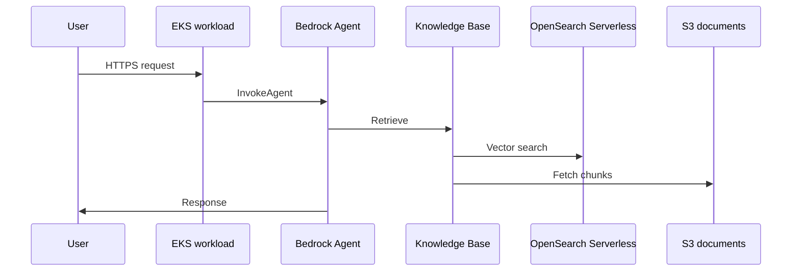

# EKS + Databricks + Bedrock — Reference Architecture

Deploy and tear down a full AWS stack for **Kubernetes**, **Databricks**, and **Bedrock RAG** using StackGen and the modules in this repo.

## Overview

This example appstack (`eks-databricks-bedrock-layer-validation`) shows how to run:

- A **private EKS cluster** for your applications  
- A **Databricks lakehouse** on a shared S3 medallion bucket  
- A **Bedrock Knowledge Base + Agent** that answers questions from documents in S3  

All three share the same VPC and storage. The stack was tested layer-by-layer in workshops so you can validate networking, data, and AI independently before a full apply.

## What gets created

| Layer | What gets created |
|-------|-------------------|
| **L1** | VPC, NAT, subnets, VPC endpoints, S3 buckets, IAM |
| **L2** | Private EKS cluster, node groups, addons |
| **L3** | Databricks external location + storage credential |
| **L4** | Bedrock KB + Agent, OpenSearch Serverless |

**Use it for:** RAG apps, lakehouse analytics, or workshop/CI validation.

---

## Architecture diagrams

### 1. Platform context

StackGen manages IaC across four planes.

### 2. Full infrastructure topology (Terraform)

Post-apply resource graph. Vector store = **OpenSearch Serverless** (`bedrock-kb-agent-native` v1.0.14+).

### 3. Network layout

Private EKS API; egress via NAT; AWS APIs via VPC endpoints.

### 4. RAG request flow (runtime)

Editable source: [`diagrams/`](diagrams/) (`.mmd` files) · Written guide: [`docs/ARCHITECTURE.md`](docs/ARCHITECTURE.md)

---

## Module versions (pin before apply)

| Module | Minimum version | Notes |
|--------|-----------------|-------|
| `bedrock-kb-agent-native` | **1.0.14** | OSS index before KB; stable OSS data-policy principals |
| `stackgen-databricks-lakehouse` | **1.0.5** | Self-assuming UC IAM trust |

Source: this repo (`main` branch or tagged release).

## Prerequisites

1. **StackGen** project with an environment profile and S3 remote state.  
2. **AWS** — Bedrock foundation models enabled in target region (validated in **us-east-1**).  
3. **Databricks** — workspace URL and token as environment secrets.  
4. **Catalog upload** — both custom modules uploaded and bound on the canvas.

## Quick start

| Action | Doc |
|--------|-----|
| **Configure secrets & env vars** | [docs/CONFIGURATION.md](docs/CONFIGURATION.md) |
| **Create** | [docs/CREATE.md](docs/CREATE.md) |
| **Destroy** | [docs/DESTROY.md](docs/DESTROY.md) |
| **Every run** | [docs/CHECKLIST.md](docs/CHECKLIST.md) |
| **Failures** | [docs/GOTCHAS.md](docs/GOTCHAS.md) |

Template: copy [`config/env.example.tfvars`](config/env.example.tfvars) — never commit real tokens.

## What is *not* in Terraform state

| Component | Behavior |
|-----------|----------|
| **Helm pack** | On canvas; deploy separately after EKS is ACTIVE |
| **Legacy managed OpenSearch** | Optional; Bedrock uses **Serverless** |
| **kubectl from laptop** | Private EKS API — VPC access required |

## Related links

- Module: [`bedrock-kb-agent-native`](../../bedrock-kb-agent-native/)  
- Module: [`stackgen-databricks-lakehouse`](../../stackgen-databricks-lakehouse/)  
- Root repo README: [`../../README.md`](../../README.md)
