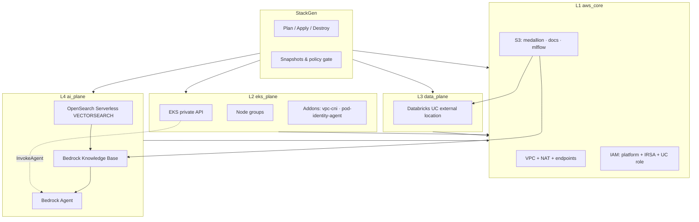

# EKS + Databricks + Bedrock — Reference Architecture

A **layer-validated** AWS reference stack for interactive RAG and lakehouse analytics. Infrastructure is defined on a [StackGen](https://stackgen.com) canvas and applied with OpenTofu; reusable logic lives in this repository’s custom modules.

## What this project is

This stack proves that four planes can be composed **deterministically** from a single topology:

| Layer | Plane | What gets created |
|-------|-------|-------------------|
| **L1** | `aws_core` | VPC `10.30.0.0/16`, private/public subnets, NAT, VPC endpoints (S3, DynamoDB, ECR, STS, EKS, Bedrock), three KMS-encrypted S3 buckets, DynamoDB, Route53 private zone, IAM roles |
| **L2** | `eks_plane` | Private EKS cluster `platform_eks`, three `t3.medium` node groups, `vpc-cni` + `eks-pod-identity-agent` addons; optional Helm workload pack (separate from core Terraform state) |
| **L3** | `data_plane` | Databricks storage credential, external location on medallion bucket, SQL warehouse endpoint |
| **L4** | `ai_plane` | Bedrock Knowledge Base + Agent, **OpenSearch Serverless** vector collection, S3 document source, embedding + inference models |

**Primary use cases**

1. **Interactive RAG** — EKS (or external) clients invoke a Bedrock Agent backed by a Knowledge Base.  
2. **Lakehouse analytics** — Databricks reads/writes the medallion S3 bucket via Unity Catalog.  
3. **Workshop / CI validation** — repeatable create → verify → destroy cycles with policy gates and snapshots.

## Architecture at a glance

Full diagrams: [`diagrams/`](diagrams/) and [`docs/ARCHITECTURE.md`](docs/ARCHITECTURE.md).

## Module versions (pin before apply)

| Module | Minimum version | Notes |
|--------|-----------------|-------|
| `bedrock-kb-agent-native` | **1.0.14** | OSS index before KB; stable OSS data-policy principals |
| `stackgen-databricks-lakehouse` | **1.0.5** | Self-assuming UC IAM trust |

Source: this repo (`main` branch or tagged release).

## Prerequisites

1. **StackGen** project with an environment profile (e.g. `swami_env`) and S3 remote state.  
2. **AWS** — Bedrock foundation models enabled; quota for EKS, OSS, and Bedrock Agent in target region (validated in **us-east-1**).  
3. **Databricks** — workspace URL and token stored as **environment secrets** (`databricks_host`, `databricks_token`).  
4. **Catalog upload** — both custom modules uploaded to the StackGen project and bound on the canvas (not legacy template-only bindings).

## Quick start

### Create

Follow **[docs/CREATE.md](docs/CREATE.md)** — snapshot → violations → plan → apply → verify.

### Destroy

Follow **[docs/DESTROY.md](docs/DESTROY.md)** — destroy plan → empty S3 or `force_destroy` → destroy → confirm state empty.

### Every run

Use **[docs/CHECKLIST.md](docs/CHECKLIST.md)** before Plan, Apply, or Destroy.

### If something fails

Read **[docs/GOTCHAS.md](docs/GOTCHAS.md)** — each item maps a real failure from workshop validation to a permanent fix.

## What is *not* in Terraform state

| Component | Behavior |
|-----------|----------|
| **Helm pack** (Agentic workload group) | On canvas; deploy separately after EKS is ACTIVE |
| **Legacy managed OpenSearch** (`kb-opensearch`) | Optional on canvas; Bedrock uses **Serverless** — remove to save cost |
| **In-cluster kubectl** | Private EKS API — access from inside VPC only |

## Related links

- Module: [`bedrock-kb-agent-native`](../../bedrock-kb-agent-native/)  
- Module: [`stackgen-databricks-lakehouse`](../../stackgen-databricks-lakehouse/)  
- Root repo README: [`../../README.md`](../../README.md)
