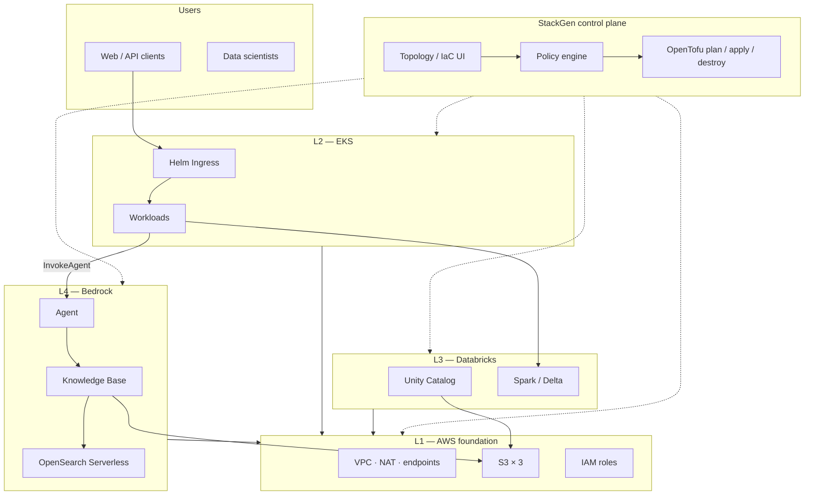
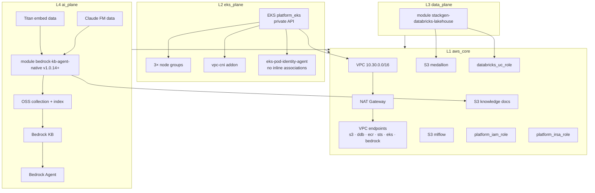
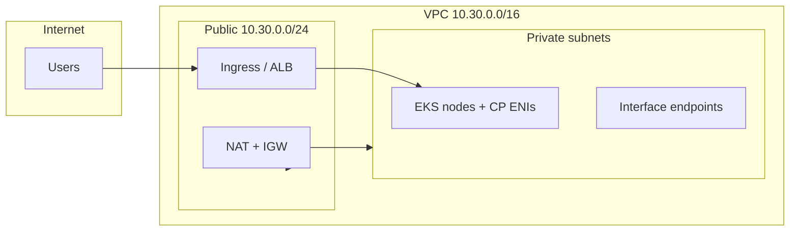
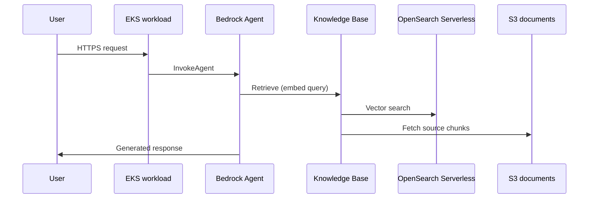

# Architecture

Technical reference for **eks-databricks-bedrock-layer-validation**: four planes, network layout, data flows, and module boundaries.

---

## Platform context

StackGen manages IaC; four planes share AWS foundation resources.

Source: [`../diagrams/platform-context.mmd`](../diagrams/platform-context.mmd)

---

## Full topology (Terraform-managed)

Post-apply resource graph (~76 managed resources in validated deployment). Bedrock vector store uses **OpenSearch Serverless** (not the optional legacy managed domain).

Source: [`../diagrams/topology.mmd`](../diagrams/topology.mmd)

---

## Network layout

Private EKS and workloads; public subnet for NAT and ingress path.

Source: [`../diagrams/network.mmd`](../diagrams/network.mmd)

---

## RAG request flow (runtime)

---

## Module boundaries

| Module | Creates | Depends on |
|--------|---------|------------|
| `bedrock-kb-agent-native` | OSS policies/collection/index, KB IAM, KB, data source, Agent, alias | S3 ARN, FM ARNs, deployer principal for OSS |
| `stackgen-databricks-lakehouse` | Storage credential, external location, SQL endpoint | UC IAM role ARN, lakehouse bucket name, Databricks provider config |

Both modules embed required providers (`databricks` inside lakehouse module; `opensearch` + `time` inside Bedrock module).

---

## State and environments

- **Remote state:** S3 backend per StackGen project/environment  
- **One appstack, many envs:** duplicate environment profile; suffix bucket names via tfvars  
- **Snapshots:** topology rollback only — not AWS resource restore  

---

## Diagram files

| File | Description |
|------|-------------|
| [`platform-context.mmd`](../diagrams/platform-context.mmd) | StackGen + four planes |
| [`topology.mmd`](../diagrams/topology.mmd) | L1–L4 resource graph |
| [`network.mmd`](../diagrams/network.mmd) | VPC subnets and NAT |

Render on [Mermaid Live Editor](https://mermaid.live) or GitHub Markdown preview.
